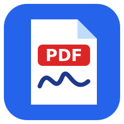
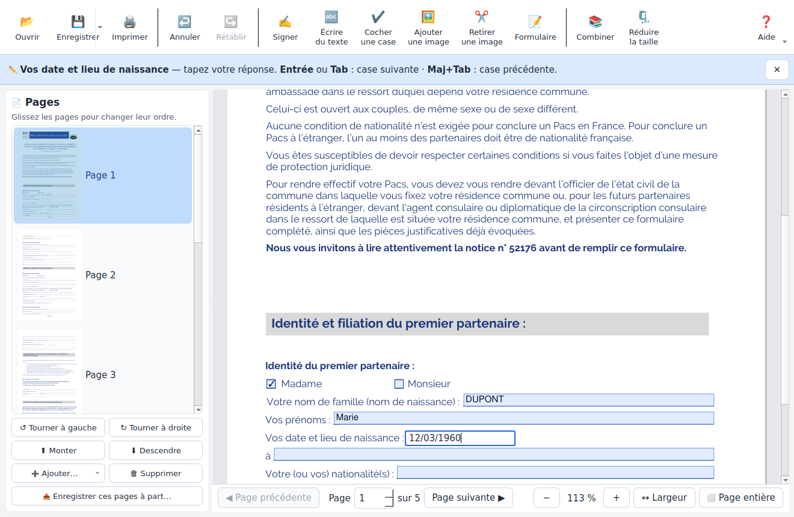
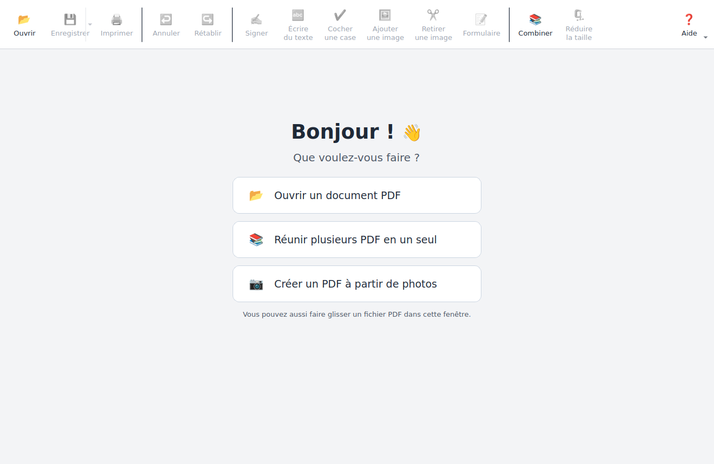
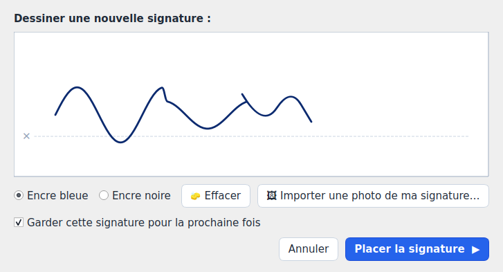
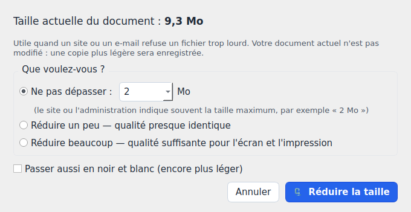

<p align="center"></p>

<h1 align="center">PDF Facile</h1>

<p align="center">
A simple PDF reader &amp; editor for Windows, entirely in French, designed for people who are not comfortable with computers.<br>
<em>Lire, remplir, signer et modifier ses PDF, simplement.</em>
</p>

<p align="center">
<a href="https://github.com/sebastien-vedrine/PDF-Facile/releases/latest"><b>⬇️ Télécharger l'installateur</b></a>
</p>



## 🇫🇷 Pour les utilisateurs

1. Téléchargez **`Installer-PDF-Facile.exe`** depuis la page [Releases](https://github.com/sebastien-vedrine/PDF-Facile/releases/latest).
2. Double-cliquez dessus, puis *Suivant* → *Terminer*. Aucun droit administrateur n'est nécessaire.
3. Si Windows affiche « Windows a protégé votre ordinateur » : **Informations complémentaires** → **Exécuter quand même** (l'installateur n'est pas signé numériquement).

Pour mettre à jour, il suffit d'installer la nouvelle version par-dessus : vos signatures et réglages sont conservés.

## Features

| | |
|---|---|
| **Forms** | Fill fields directly on the page (Tab / Enter → next field, across pages). Flattened "print-only" forms (e.g. French *cerfa*) are analysed and turned into real fillable fields: underlines, typed `____`, checkboxes (drawn or `□` glyphs), `I__I__I` date / postcode cells, with labels and section headings. |
| **Writing** | Type text anywhere, tick boxes — stays editable, movable and deletable after saving (PDF annotations). Bold / italic / underline, size, colour, "today's date" button. |
| **Signature** | Draw with the mouse or import a photo (white background removed automatically); signatures are saved for reuse. |
| **Pages** | Rotate, reorder (drag &amp; drop), delete, insert blank pages / other PDFs / photos, extract pages to a new file. |
| **Files** | Combine PDFs and photos with preview, create a PDF from photos, reduce file size to a target (e.g. "≤ 2 Mo"), print in colour or true black &amp; white. |
| **Safety net** | 30-step undo / redo, nothing written to disk until *Enregistrer*, atomic saves, unsaved-changes warning. |
| **Onboarding** | Skippable welcome tour, dismissible tips bar, contextual instruction bar for every mode. |

<p>


</p>
<p>

</p>

## Development

Requirements: Windows, Python 3.10+.

```bat
pip install -r requirements.txt
python pdf_facile.py
```

### Build the installer locally

Double-click **`build.bat`**. It installs Python and Inno Setup through `winget` if missing, builds the app with PyInstaller, and produces `dist\Installer-PDF-Facile.exe`.

### Release through GitHub Actions

1. Bump `APP_VERSION` in `pdf_facile.py` and add an entry to `CHANGELOG.md`.
2. Commit, then tag and push:
   ```bash
   git tag v1.7
   git push origin main --tags
   ```
3. The [workflow](.github/workflows/build.yml) builds on a Windows runner and publishes the installer as a GitHub Release (the tag must match `APP_VERSION`). It can also be run manually from the *Actions* tab.

### Project layout

| File | Purpose |
|---|---|
| `pdf_facile.py` | The whole application (PySide6 UI + PyMuPDF engine) |
| `installer.iss` | Inno Setup script (per-user install, French wizard, "Ouvrir avec" registration) |
| `build.bat` | Local build: venv → PyInstaller → installer |
| `install.bat` / `uninstall.bat` | Fallback install without Inno Setup |

### Technical notes

- Added texts and check marks are standard FreeText / Ink annotations (printable), tagged with a private `/PFMeta` key so the app can re-edit them; other viewers display them normally.
- Detected fields are real AcroForm widgets (named `pf_p<page>_<n>`), so the saved PDF is fillable in any reader.
- User data: `%APPDATA%\PDFFacile\PDF Facile\` (saved signatures, error log); settings in the registry under `HKCU\Software\PDFFacile`.

## License

[AGPL-3.0](LICENSE) — required by [PyMuPDF](https://github.com/pymupdf/PyMuPDF)'s license. Also uses [Qt for Python (PySide6)](https://doc.qt.io/qtforpython/) under LGPL-3.0.
